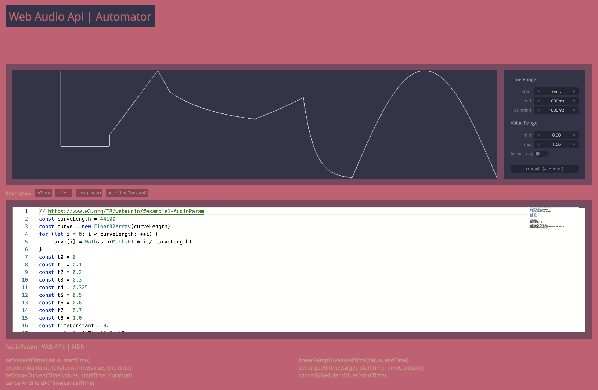

# Web Audio Api | Automator
A simple editor which previews AudioParam automations. The web-audio-api automation methods are quite cumbersome, hence visual help is highly appreciated. 

[Open](https://andremichelle.github.io/web-audio-api-automator/) | Tested in Chrome, Firefox & Safari (desktop versions)

### Build
Make sure to have sass installed and run in the console:

    sass sass/main.sass:bin/main.css --watch

Make sure to have typescript installed and run in the console:

    tsc -p ./typescript/tsconfig.json --watch

### Todo
* syntax highlighting
* find location of code errors and display error message
* save, load, share code